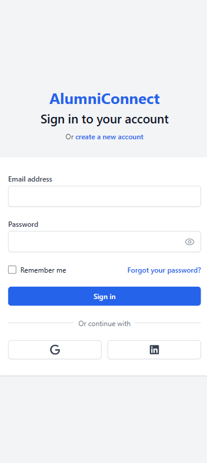
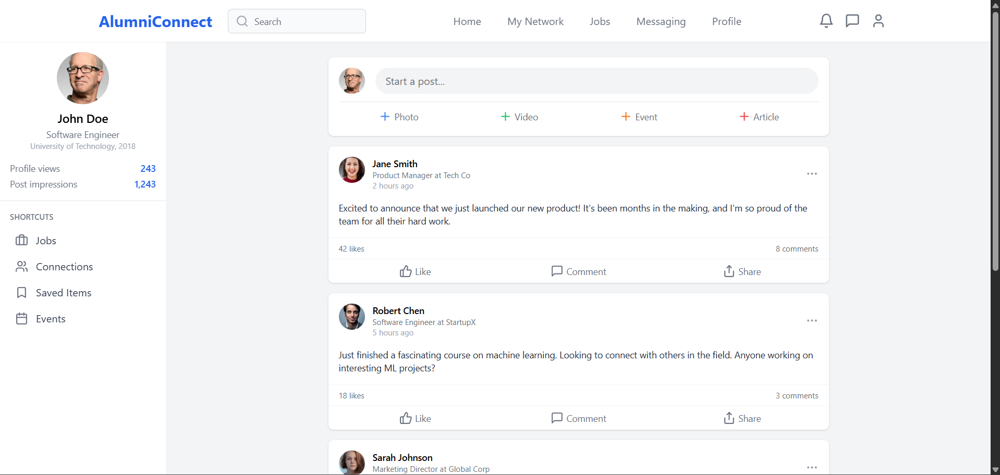
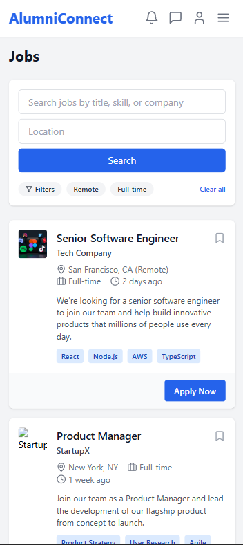
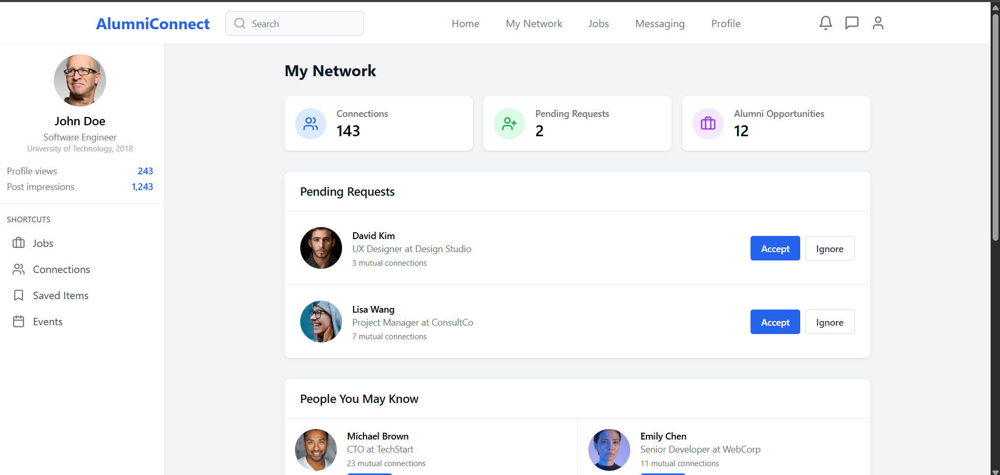
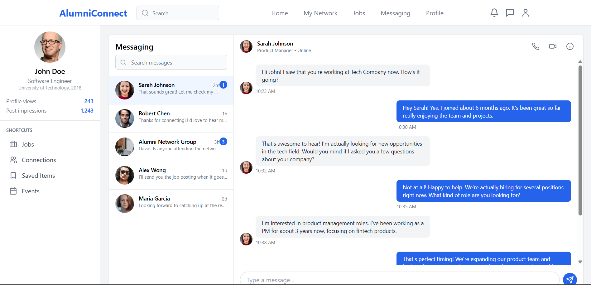

# Alumni Platform 👨‍🎓👩‍🎓

A responsive frontend application that facilitates alumni-student interaction, job updates, mentoring support, and networking — built using **React.js**, **TypeScript**, and **Tailwind CSS**.

---

## 🛠 Tech Stack

- **React.js** (with **TypeScript**)
- **Tailwind CSS**
- **React Router DOM**
- **Component-based Architecture**
- **Vite** (Build Tool)
- **JavaScript (ES6+)**

---

## 🚀 Features

- 💬 Real-time Chat UI _(Frontend layout only)_
- 🧑‍💼 Job Board UI for latest opportunities
- 🎓 Mentorship Section to connect students with alumni
- 🔍 Alumni Directory with search feature
- 📱 Responsive across all screen sizes
- 🌗 Dark Mode Ready _(Optional)_

---

## 📸 Screenshots

### 🔐 Login Page



### 🏠 Dashboard / Home Page



### 🧑‍💼 Job Listings



### 👥 Alumni Directory



### 💬 Chat Interface



---

## 🧑‍💻 Getting Started Locally

```bash
git clone https://github.com/Bharatgwl/Alumni-Platform.git
cd Alumni-Platform
npm install
npm run dev
```
